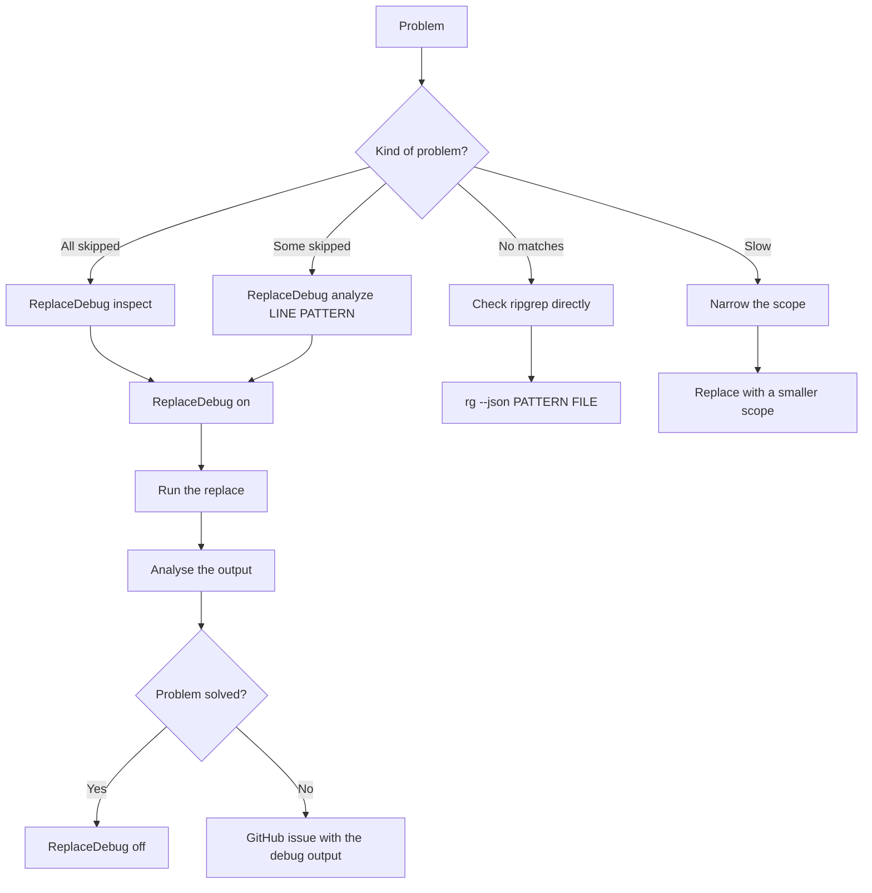

# Replacer Debug Guide

## Quick Diagnosis

### Scenario 1: "all matches are skipped"

```vim
" Symptom:
[replacer] skip changed spot: file.lua:45:5
[replacer] skip changed spot: file.lua:42:5
[replacer] 0 spot(s) in 1 file(s)

" Diagnosis:
:ReplaceDebug on
:ReplaceDebug inspect
:Replace "your-pattern" "new-text" %

" Common causes:
" 1. The file changed in the meantime
" 2. A UTF-8 encoding problem
" 3. Ripgrep finds the pattern, but the offsets are wrong
```

**Solution:**
```lua
-- In setup(), enable temporarily:
ext_highlight_opts = {
  debug = true,  -- shows hex dumps
}
```

---

### Scenario 2: "only the first occurrence is found"

```vim
" Symptom:
" The line has "test test test", but only 1 match in the picker

" Diagnosis:
:ReplaceDebug analyze 45 "test"
```

**Expected output:**
```
=== Analyzing line 45 ===
Pattern: 'test'
Line: 'test test test'
Byte length: 14
Char length: 14

Occurrences:
  #1: bytes [0:3] chars [0:4] text='test'
  #2: bytes [5:8] chars [5:9] text='test'
  #3: bytes [10:13] chars [10:14] text='test'
```

**If only 1 occurrence is shown:**
→ ripgrep delivers incomplete submatches
→ Fixed: the fallback scan in `rg.lua` kicks in

---

### Scenario 3: "UTF-8 characters (umlauts, emoji) are wrong"

```vim
" Symptom:
:Replace "Müller" "Mueller" %
[replacer] skip (mismatch): expected 'Müller', got 'M?ller'

" Or:
[replacer] skip (out of range): s=15 e=19 len=18
```

**Diagnosis:**
```vim
:ReplaceDebug analyze 45 "Müller"
```

**Expected output (correct):**
```
Occurrences:
  #1: bytes [0:6] chars [0:6] text='Müller'
       ^ ü = 2 bytes (C3 BC)
```

**If bytes/chars do not line up:**
→ check the file encoding: `:set fileencoding?`
→ it should be `utf-8`

**Fix:**
```vim
:set fileencoding=utf-8
:w
:Replace "Müller" "Mueller" %
```

---

### Scenario 4: "the pattern works in ripgrep, but not in the plugin"

```bash
# Terminal: works
$ rg --json "test" file.lua
{"type":"match","data":{...}}

# Plugin: finds nothing
:Replace "test" "new" %
[replacer] no matches found
```

**Diagnosis:**
```vim
:ReplaceDebug on
:Replace "test" "new" %
```

**Possible outputs:**

**Case A: a ripgrep error**
```
[replacer] rg failed: <error message>
```
→ check the ripgrep args in the config

**Case B: a JSON parse error**
```
" Nothing in the debug output
```
→ ripgrep returns no valid JSON
→ check: `rg --version` (11.0 minimum)

**Case C: empty submatches**
```
[replacer] Found 0 match(es)
```
→ ripgrep finds matches, but the submatches array is empty
→ the fallback scan should kick in (already in the fix)

---

### Scenario 5: "the replacement works, but is not saved"

```vim
:Replace "old" "new" %
[replacer] 5 spot(s) in 1 file(s)

" But the file is unchanged
```

**Check the config:**
```lua
require("replacer").setup({
  write_changes = true,  -- has to be true!
})
```

**Or save manually:**
```vim
:w
```

---

### Scenario 6: "performance: the replacement takes forever"

```vim
" On large files (>10k lines)
:Replace "common-word" "new" cwd
" ... hangs ...
```

**Diagnosis:**
```vim
:ReplaceDebug inspect
" Check: line_count

" If > 10,000:
```

**Optimization:**
```lua
-- Narrow the scope
:Replace "word" "new" %  -- only the current buffer
:Replace "word" "new" src/  -- only the src/ directory
```

**Or ripgrep options:**
```lua
require("replacer").setup({
  exclude_git_dir = true,  -- Skip .git/
  git_ignore = true,  -- Respect .gitignore
})
```

---

## Interpreting the test suite

```vim
:ReplaceDebug test
```

**All tests pass:**
```
✓ ASCII baseline
✓ UTF-8 offsets
✓ Match validation
✓ Emoji offsets
✓ Ripgrep submatch simulation
✓ Line normalization

=== Results: 6 passed, 0 failed ===
```
→ **the plugin works correctly**

**A test failure:**
```
✗ UTF-8 offsets FAILED: assertion failed
```
→ **a Neovim/Lua UTF-8 support problem**
→ check the Neovim version (0.9 minimum)

---

## Understanding the mismatch hex dump

```vim
:ReplaceDebug on
:Replace "Müller" "Mueller" %

[replacer] skip (mismatch): file.lua:45:5
  expected: 'Müller' [4D C3 BC 6C 6C 65 72]
  actual:   'Muller' [4D 75 6C 6C 65 72]
```

**Interpretation:**
```
'Müller'
 M  ü  l  l  e  r
 4D C3BC 6C 6C 65 72  (bytes)
    ^^^^
    ü = C3 BC (2 bytes UTF-8)

'Muller'
 M  u  l  l  e  r
 4D 75 6C 6C 65 72
    ^^
    u = 75 (1 byte ASCII)
```

**Meaning:**
- The file has "Muller" (without the umlaut)
- You are searching for "Müller" (with the umlaut)
→ **the pattern does not match**

**Fix:**
```vim
" Either:
:Replace "Muller" "Mueller" %  " search without the umlaut

" Or correct the file:
:%s/Muller/Müller/g
:w
:Replace "Müller" "Mueller" %
```

---

## Common Pitfalls

### 1. Literal vs Regex Mode

```lua
-- Default: Literal (fixed-strings)
:Replace "test.*" "new" %
" Finds: "test.*" (a literal dot-star)

-- Regex Mode:
require("replacer").setup({
  literal = false,
})
:Replace "test.*" "new" %
" Finds: "test" + arbitrary chars
```

### 2. Smart Case

```lua
-- With smart_case = true (default):
:Replace "Test" "new" %
" Finds: "Test", "TEST", "test"

:Replace "test" "new" %
" Finds only: "test" (all lowercase)
```

### 3. Scope Confusion

```vim
" The current buffer:
:Replace "old" "new" %

" Current Working Directory:
:Replace "old" "new" cwd

" A specific path:
:Replace "old" "new" /path/to/project

" Do NOT confuse it with:
:Replace "old" "new"  " → the default is cwd!
```

---

## Debug-mode best practices

1. **Enable it only temporarily** (verbose output!)
   ```vim
   :ReplaceDebug on
   " ... debug session ...
   :ReplaceDebug off
   ```

2. **Inspect before replacing** (check the buffer state)
   ```vim
   :ReplaceDebug inspect
   :Replace "pattern" "new" %
   ```

3. **Analyze on mismatches** (understand the offsets)
   ```vim
   " On skip warnings:
   :ReplaceDebug analyze <line> "<pattern>"
   ```

4. **Test before large replacements**
   ```vim
   :ReplaceDebug test  " verify the plugin works
   :Replace "pattern" "new" .  " then the actual replace
   ```

---

## Reporting Bugs

If the problems persist, collect the following info:

```vim
:ReplaceDebug on
:ReplaceDebug inspect
:Replace "your-pattern" "new" scope

" Copy the output and report:
" 1. Neovim version
:version

" 2. Ripgrep version
:!rg --version

" 3. File encoding
:set fileencoding?

" 4. Config
:lua print(vim.inspect(require("replacer").options))

" 5. Debug output (see the buffer)
```

**GitHub Issue Template:**
```markdown
## Problem Description
"skip changed spot" warnings for all matches

## Environment
- Neovim: 0.10.0
- Ripgrep: 14.0.3
- File Encoding: utf-8

## Config
```lua
require("replacer").setup({
  engine = "telescope",
  literal = true,
})
```

## Debug Output
```
[replacer] Found 5 match(es)
[replacer] skip (mismatch): file.lua:45:5
  expected: 'Müller' [...]
  actual: 'Muller' [...]
```

## Minimal Reproduction
1. Create file with: "Müller test Müller"
2. :Replace "Müller" "Mueller" %
3. See skip warnings
```

---

## Summary: the debug workflow


