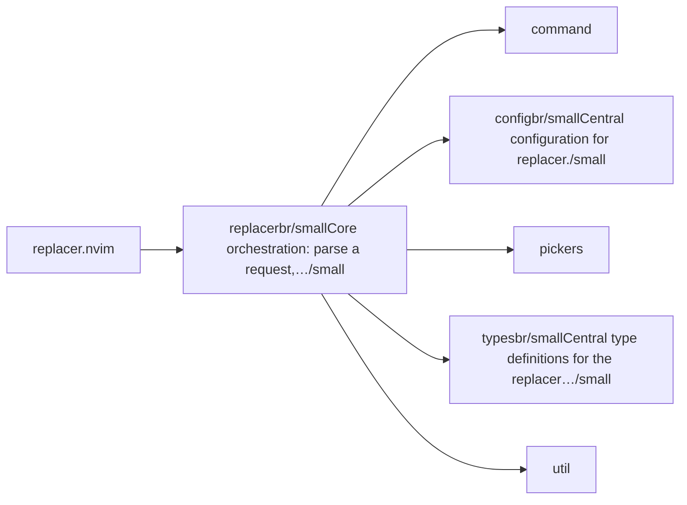
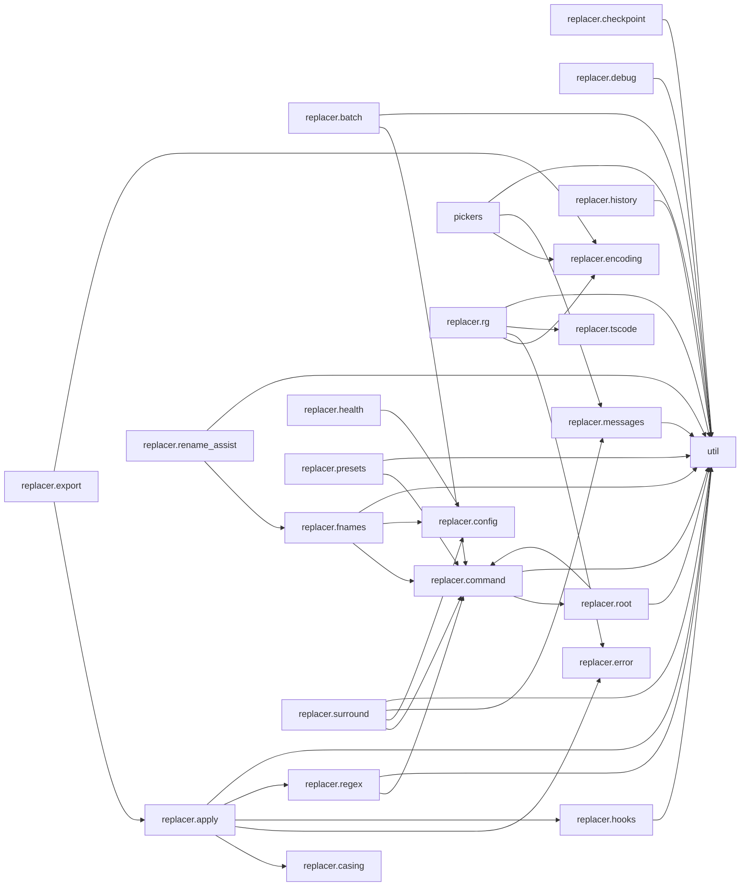

# replacer.nvim — module map

> **Generated** by `documentation`. Do not edit by hand — run `:DocMap`
> (or `nvim --headless -l scripts/gen_map.lua`) to regenerate.

**3 modules** · 4 namespaces · 32 helper files

The [interactive map](index.html) has filtering, full descriptions and
source links; this page is the version the code host renders directly.

## Namespaces

## Dependencies

Which parts of the tree require which, rolled up to the second level.
The [interactive map](index.html)'s **Deps** view has this per module,
in both directions, with load-time and lazy requires told apart.

## Modules

| Module | Description | Fns | Docs |
|---|---|---|---|
| `replacer` | Core orchestration: parse a request, collect matches, then either plan (dry-run / export) or apply (interactive picker / non-interactive ALL). | 8 | [src](../../lua/replacer/init.lua) |
| &nbsp;&nbsp;`command` |  |  |  |
| &nbsp;&nbsp;`replacer.config` | Central configuration for replacer. | 13 | [src](../../lua/replacer/config/init.lua) |
| &nbsp;&nbsp;`pickers` |  |  |  |
| &nbsp;&nbsp;`replacer.types` | Central type definitions for the replacer plugin. |  | [src](../../lua/replacer/types/init.lua) |
| &nbsp;&nbsp;`util` |  |  |  |

## Drift

0 errors · 1 warnings · 17 info

| Severity | Check | Message |
|---|---|---|
| warn | `doc-references-missing` | docs/TODO-Guidelines-Review.md:53 references 'replacer.options', but replacer has no 'options' |

17 informational findings

| Check | Message |
|---|---|
| `missing-readme` | lua/replacer has no README.md |
| `missing-readme` | lua/replacer/config has no README.md |
| `missing-readme` | lua/replacer/types has no README.md |
| `undocumented-param` | M.setup has 1 parameter(s) but only 0 @param line(s) |
| `undocumented-param` | M.resolve has 1 parameter(s) but only 0 @param line(s) |
| `undocumented-param` | M.preview_lines_with_pos has 2 parameter(s) but only 0 @param line(s) |
| `undocumented-param` | M.notify_result has 3 parameter(s) but only 0 @param line(s) |
| `undocumented-param` | M.register_which_key has 2 parameter(s) but only 0 @param line(s) |
| `unreferenced-module` | replacer.batch is required by no other file in the tree |
| `unreferenced-module` | replacer.debug is required by no other file in the tree |
| `unreferenced-module` | replacer.health is required by no other file in the tree |
| `unreferenced-module` | replacer.pickers.utils is required by no other file in the tree |
| `unreferenced-module` | replacer.presets is required by no other file in the tree |
| `unreferenced-module` | replacer.surround is required by no other file in the tree |
| `unreferenced-module` | replacer.types is required by no other file in the tree |
| `unreferenced-module` | replacer.types.config is required by no other file in the tree |
| `unreferenced-module` | replacer.types.pickers is required by no other file in the tree |

