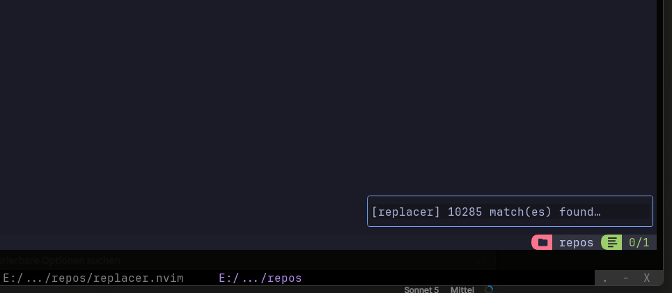

# Progress Indicator

A `:Replace`/`:Replacer` search on a large scope (`cwd`, a big directory) can
take anywhere from instant to several seconds, depending on repo size and
whether ripgrep is available. Without any feedback that looks like a hang.
Replacer solves this via [`lib.nvim.progress`](https://github.com/StefanBartl/lib.nvim/blob/main/lua/lib/nvim/progress/README.md):
a small, reusable progress-indicator abstraction that decouples "an operation
is running" from "how that gets shown".

- **The one soft edge of a hard dependency.** `lib.nvim` itself is
  [required](installation.md#requirements) — replacer does not load without
  it. This *module* of it is the exception: `rg.lua` resolves
  `lib.nvim.progress` through a `pcall`, so an older lib.nvim without it means
  searches run silently, no error, nothing else missing.
- **Debounced.** A handle only becomes visible after ~150ms. A fast search on
  a small scope never flashes any UI, no matter which style you pick.
- **Configured via one option:** `progress_style` in `require("replacer").setup({...})`.

```lua
require("replacer").setup({
  progress_style = "auto", -- "auto" | "notify" | "statusline" | "fidget" | "float" | "kit"
})
```

---

## Installation

`lib.nvim` is already in replacer's dependency list — see
[installation.md](installation.md). Nothing extra is needed for `"auto"`,
`"notify"`, `"statusline"`, `"float"` or `"kit"`; only `"fidget"` wants a
second plugin.

```lua
{
  "StefanBartl/replacer.nvim",
  dependencies = { "StefanBartl/lib.nvim", "ibhagwan/fzf-lua" },
  opts = { progress_style = "auto" },
}
```

---

## Styles, in detail

### `"auto"` (default)

Prefers `"fidget"` if [fidget.nvim](https://github.com/j-hui/fidget.nvim) is
installed and loadable, otherwise falls back to `"notify"`. Never picks
`"float"`/`"kit"` on its own — those styles are more intrusive (they open a
real window) and must be requested explicitly.

Use this if you just want *something* reasonable without thinking about it.

### `"notify"`

Uses `vim.notify`. If your active notify backend returns a record with an
`.id` field (e.g. [nvim-notify](https://github.com/rcarriga/nvim-notify)),
updates replace the previous notification in place — you see one line that
keeps updating. Without such a backend (plain core `vim.notify`, `mini.notify`
without id support, etc.), every update is a new sequential notification —
still correct, just not visually merged.

```lua
require("replacer").setup({ progress_style = "notify" })
```

Recorded: [`Materials/progress/notify.mp4`](Materials/progress/notify.mp4).

### `"statusline"`

This style **draws nothing**. It exists specifically so you can surface the
live search status inside your *own* statusline instead of a separate
notification or floating window. See the [dedicated section](#using-the-statusline-style)
below — this is the style most worth reading the details on. Recorded (as
driven from a real statusline component):
[`Materials/progress/statusline.mp4`](Materials/progress/statusline.mp4).

### `"fidget"`

Delegates to fidget.nvim's LSP-style progress handles — the same corner
widget you already see for LSP progress, reused for replacer's search. Needs
`fidget.nvim` installed; if it isn't, `resolve_style` falls back to `"notify"`
transparently (this only matters if you request `"fidget"` explicitly — `"auto"`
already handles the detection).

```lua
require("replacer").setup({ progress_style = "fidget" })
```

Recorded: [`Materials/progress/fidget.mp4`](Materials/progress/fidget.mp4).

### `"float"`

A small, borderless-adjacent floating window in the bottom-right corner. It
is deliberately **not** focused on creation (`enter = false`) — a running
search never interrupts whatever you're doing. To cancel a search:

1. Focus that window on purpose (e.g. `<C-w>w` until you land on it, or click
   it with the mouse).
2. Press `<Esc>` in normal mode.
3. A short confirm prompt appears: *"[replacer] is still running. Abort it?"*
   — `Yes` cancels the search (kills the ripgrep process, or stops the native
   vimgrep scan on its next chunk); `No` leaves everything running untouched.

Because that `<Esc>` keymap is **buffer-local** to the progress window, it is
physically impossible to trigger it by accident from any other window — no
global keymap is registered, so your own `<Esc>` mappings elsewhere are never
affected.

```lua
require("replacer").setup({ progress_style = "float" })
```



The window auto-closes a moment after the search finishes (or is cancelled),
showing the final result text first. Recorded:
[`Materials/progress/float.mp4`](Materials/progress/float.mp4).

### `"kit"`

Identical interaction model to `"float"` — same non-focus-stealing window,
same focus + `<Esc>` + confirm-prompt cancel flow — but rendered through
[`lib.nvim.ui.kit`](https://github.com/StefanBartl/lib.nvim/blob/main/lua/lib/nvim/ui/kit/README.md)'s
themed `surface` primitive instead of a hardcoded border. If you already use
`lib.nvim.ui.kit` for other popups in your config (notes, toasts, confirms),
`"kit"` gives the progress window the same border/highlight preset instead of
looking like a one-off.

```lua
require("replacer").setup({ progress_style = "kit" })
```

Pick a specific ui.kit preset for just this handle via `kit_theme` — not
exposed as a top-level `replacer` option (it's a `lib.nvim.progress`-level
knob), so set it once for your whole config instead:

```lua
require("lib.nvim.ui.kit").setup({ default = "double" }) -- affects every kit popup, including replacer's
```

---

## Using the `"statusline"` style

Set it once:

```lua
require("replacer").setup({ progress_style = "statusline" })
```

Then, in whatever renders your statusline, pull the current text(s) from
`lib.nvim.progress.styles.statusline`:

```lua
local replacer_status = require("lib.nvim.progress.styles.statusline")

--- @return string
local function replacer_component()
  local active = replacer_status.active() -- string[], oldest first
  if #active == 0 then
    return "" -- nothing running: render nothing
  end
  return table.concat(active, " | ")
end
```

`active()` returns one entry per currently in-flight progress handle across
**all** plugins that use the `"statusline"` style (not just replacer) — it's
a shared, headless registry, not a replacer-specific API. Each entry already
contains the handle's `title` prefix (e.g. `"[replacer] "`), so multiple
concurrent operations are still distinguishable. The list updates itself live
on every `h:update(...)` and empties itself again on `finish`/`cancel` — no
polling, no manual cleanup, no leaked entries if a search errors out. Every
change also calls `:redrawstatus`, so your statusline visibly refreshes even
while you're sitting idle — not just on the next unrelated redraw (cursor
move, mode change, …).

### Plugging it into `vim.o.statusline` directly

```lua
_G.replacer_statusline_component = function()
  local ok, sl = pcall(require, "lib.nvim.progress.styles.statusline")
  if not ok then return "" end
  local active = sl.active()
  return #active > 0 and (" " .. active[1] .. " ") or ""
end

vim.o.statusline = "% " .. vim.o.statusline
```

### Plugging it into lualine

```lua
require("lualine").setup({
  sections = {
    lualine_x = {
      function()
        local ok, sl = pcall(require, "lib.nvim.progress.styles.statusline")
        if not ok then return "" end
        local active = sl.active()
        return #active > 0 and active[1] or ""
      end,
      -- your other lualine_x components...
    },
  },
})
```

Both snippets guard with `pcall` so your statusline never errors if `lib.nvim`
(or replacer) isn't loaded in a given session.

---

## Notes

- `progress_throttle_ms` (default `100`) sets the minimum time between
  redraws while streaming ripgrep's stdout. Raise it if a `"notify"` backend
  that cannot replace in place floods you on a large search; lower it for a
  smoother bar.
- Cross-platform by construction — the underlying module only uses
  `vim.uv`/`vim.api`/`vim.notify`, no OS-specific calls, no shelling out. All
  styles behave identically on Linux, macOS and Windows.
- Cancelling a ripgrep-backed search kills the underlying process (`SIGTERM`);
  cancelling a native `vimgrep` scan stops it at the next processed file
  chunk (at most ~25 files later) rather than mid-file.
- `--dry`/`--export` runs still go through the same search/collect step, so
  the progress indicator applies to them too — cancelling one just aborts the
  plan computation, nothing was ever written anyway.
- See [`lib.nvim.progress`](https://github.com/StefanBartl/lib.nvim/blob/main/lua/lib/nvim/progress/README.md)
  if you want to reuse the same indicator in your own plugins, or add a new
  style (e.g. a corner-notification plugin you already use).
